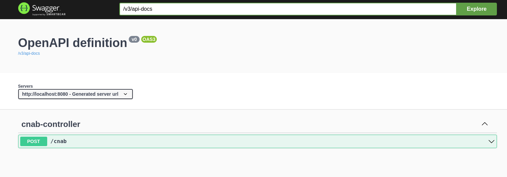
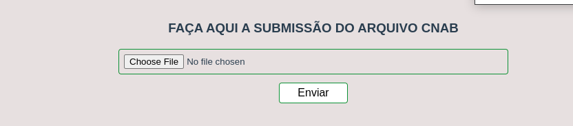

# Desafio programação

Projecto desenvolvido para como requisito do teste para desenvolvedor Java

# Descrição do projeto

Você recebeu um arquivo CNAB com os dados das movimentações finanaceira de várias lojas.
Precisamos criar uma maneira para que estes dados sejam importados para um banco de dados.

Sua tarefa é criar uma interface web que aceite upload do [arquivo CNAB](https://github.com/ByCodersTec/desafio-ruby-on-rails/blob/master/CNAB.txt), normalize os dados e armazene-os em um banco de dados relacional e exiba essas informações em tela.

**Sua aplicação web DEVE:**

- [x] 1.  Ter uma tela (via um formulário)
- [x] 2.  Interpretar ("parsear") o arquivo recebido, normalizar os dados, e salvar corretamente a informação

- [x] 3. Exibir uma lista das operações importadas por lojas, e nesta lista deve conter um totalizador do saldo em conta

- [x] 4. Ser escrita na sua linguagem de programação de preferência
- [x] 5. Ser simples de configurar e rodar, funcionando em ambiente compatível com Unix (Linux ou Mac OS X). Ela deve utilizar apenas linguagens e bibliotecas livres ou gratuitas.

- [x] 6. Git com commits atomicos e bem descritos

- [x] 7. PostgreSQL, MySQL ou SQL Server

8. Ter testes automatizados

- [x] 9. Docker compose (Pontos extras se utilizar)

- [x] 10. Readme file descrevendo bem o projeto e seu setup

- [x] 11. Incluir informação descrevendo como consumir o endpoint da API

# Requisitos

## backend

- [x] Java 11
- [x] Maven 3.8.5
- [x] Docker e Docker-Compose

## frontend

- [x] nodejs 16.14.2
- [x] VueJs 3.2.25
- [x] axios: 0.27.2
- [x] Vite
- [x] yarn ou npm

## Tecnológias utilizadas

- [x] Docker e Docker-Compose
- [x] Spring-boot
- Data
- Web
- MVC
- [x] PostgreSQL
- [x] Open-Api (Swagger)
- [x] NodeJS
- [x] VueJs
- [x] Axios

## Subindo a aplicacao

Primeira mente tens de estar o diretorrio **raiz(desafio-dev)**
e rodar o comndo abaixo para subir o **container do postgres com o docker**

```
 docker-compose up
```

Para subir a aplicação(Backend) roda o comando abaixo

```
 mvn spring-boot:run
```

Para subir a aplicação(Frontend) roda o comando abaixo

```
 yarn dev
```

### Open Api - Swagger( Documentação ou Resultado)

Link: http://localhost:8080/swagger-ui/index.html

## 

### Frontend (Resultado)

Link: http://localhost:3000

## 

---
